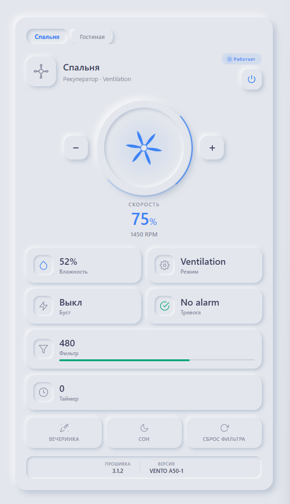

# Blauberg Recuperator Card

[](https://github.com/hacs/integration)
[](https://github.com/skeep83/blauberg-recuperator-card/releases)
[](https://opensource.org/licenses/MIT)

A premium **neumorphic** Home Assistant custom card for [Blauberg](https://blaubergventilatoren.de/) / Siku wall-mounted recuperators with **multi-device support** — control up to 5 recuperators from a single card.

<p align="center">
  
</p>

## ✨ Features

| Feature | Description |
|---------|-------------|
| 🌀 **Animated Fan** | SVG fan blades spin when active — speed proportional to RPM |
| 🔄 **Multi-Device** | Switch between up to 5 recuperators via tabs |
| 📊 **Sensor Dashboard** | Humidity, mode, boost, alarm, filter timer, timer |
| 🎛️ **Speed Control** | Adjust fan speed with ± buttons |
| 🎉 **Quick Actions** | Party mode, sleep mode, reset filter alarm |
| 🌗 **Auto Dark Mode** | Follows HA theme / `prefers-color-scheme` |
| ⚙️ **Visual Editor** | Full GUI configuration — no YAML needed |
| 🎨 **Neumorphic Design** | Matches [Altal Heater Card](https://github.com/skeep83/altal_heater_card) style |

## 📦 Installation

### HACS (Recommended)

1. Open **HACS** → **Frontend** → ⋮ → **Custom repositories**
2. Add `https://github.com/skeep83/blauberg-recuperator-card` as **Dashboard**
3. Search for and install **Blauberg Recuperator Card**
4. Restart Home Assistant

### Manual

1. Download `blauberg-recuperator-card.js` from the [latest release](https://github.com/skeep83/blauberg-recuperator-card/releases/latest)
2. Copy to `config/www/community/blauberg-recuperator-card/`
3. Add resource in HA:
   - **URL:** `/local/community/blauberg-recuperator-card/blauberg-recuperator-card.js`
   - **Type:** JavaScript Module

## 🔗 Prerequisites

This card requires the [Siku Integration](https://github.com/hmn/siku-integration) to be installed in your Home Assistant.

## 🚀 Usage

### Single Device

```yaml
type: custom:blauberg-recuperator-card
devices:
  - name: Спальня Амели
    fan_entity: fan.siku_blauberg_fan_192_168_1_41
    sensor_alarm: sensor.alarm
    sensor_boost_mode: sensor.boost_mode
    sensor_filter_timer: sensor.filter_timer_countdown
    sensor_humidity: sensor.humidity
    sensor_mode: sensor.mode
    sensor_rpm: sensor.rpm
    sensor_timer: sensor.timer_countdown
    button_party: button.party_mode
    button_reset_filter: button.reset_filter_alarm
    button_sleep: button.sleep_mode_2
    sensor_firmware: sensor.firmware_version
    sensor_version: sensor.version
```

### Multiple Devices

```yaml
type: custom:blauberg-recuperator-card
devices:
  - name: Спальня Амели
    fan_entity: fan.siku_blauberg_fan_192_168_1_41
    sensor_alarm: sensor.alarm
    sensor_boost_mode: sensor.boost_mode
    sensor_filter_timer: sensor.filter_timer_countdown
    sensor_humidity: sensor.humidity
    sensor_mode: sensor.mode
    sensor_rpm: sensor.rpm
    sensor_timer: sensor.timer_countdown
    button_party: button.party_mode
    button_reset_filter: button.reset_filter_alarm
    button_sleep: button.sleep_mode_2
    sensor_firmware: sensor.firmware_version
    sensor_version: sensor.version

  - name: Мастер Спальня
    fan_entity: fan.siku_blauberg_fan_192_168_1_49
    sensor_alarm: sensor.alarm_3
    sensor_boost_mode: sensor.boost_mode_3
    sensor_filter_timer: sensor.filter_timer_countdown_3
    sensor_humidity: sensor.humidity_3
    sensor_mode: sensor.mode_3
    sensor_rpm: sensor.rpm_3
    sensor_timer: sensor.timer_countdown_3
    button_party: button.party_mode_2
    button_reset_filter: button.reset_filter_alarm_2
    button_sleep: button.sleep_mode
    sensor_firmware: sensor.firmware_version_3
    sensor_version: sensor.version_3

  - name: Спальня Пацанов
    fan_entity: fan.siku_blauberg_fan_192_168_1_50
    sensor_alarm: sensor.alarm_2
    sensor_boost_mode: sensor.boost_mode_2
    sensor_filter_timer: sensor.filter_timer_countdown_2
    sensor_humidity: sensor.humidity_2
    sensor_mode: sensor.mode_2
    sensor_rpm: sensor.rpm_2
    sensor_timer: sensor.timer_countdown_2
    button_party: button.party_mode_3
    button_reset_filter: button.reset_filter_alarm_3
    button_sleep: button.sleep_mode_5
    sensor_firmware: sensor.firmware_version_2
    sensor_version: sensor.version_2
```

## ⚙️ Configuration Options

### Device Configuration

| Option | Type | Required | Description |
|--------|------|----------|-------------|
| `name` | string | ✅ | Display name for the device tab |
| `fan_entity` | string | ✅ | Main fan entity (fan.xxx) |
| `sensor_humidity` | string | ❌ | Humidity sensor |
| `sensor_mode` | string | ❌ | Operating mode sensor |
| `sensor_boost_mode` | string | ❌ | Boost mode sensor |
| `sensor_alarm` | string | ❌ | Alarm sensor |
| `sensor_filter_timer` | string | ❌ | Filter timer countdown |
| `sensor_rpm` | string | ❌ | Fan RPM sensor |
| `sensor_timer` | string | ❌ | Timer countdown |
| `button_party` | string | ❌ | Party mode button |
| `button_reset_filter` | string | ❌ | Reset filter alarm button |
| `button_sleep` | string | ❌ | Sleep mode button |
| `sensor_firmware` | string | ❌ | Firmware version sensor |
| `sensor_version` | string | ❌ | Device version sensor |

### Card Options

| Option | Type | Default | Description |
|--------|------|---------|-------------|
| `show_controls` | boolean | `true` | Show fan dial and speed controls |
| `compact` | boolean | `false` | Compact card layout |
| `text_color` | string | — | Custom text color (CSS) |
| `animation_color` | string | — | Custom accent color (CSS) |

## 🧠 Smart Automation Package

Turn your recuperators into an intelligent climate system. The included `packages/smart_recuperator.yaml` coordinates your recuperators with heating, humidity sensors, weather data, and more.

### Installation

1. Copy `packages/smart_recuperator.yaml` to your HA `config/packages/` directory
2. Add to your `configuration.yaml`:
   ```yaml
   homeassistant:
     packages:
       smart_recuperator: !include packages/smart_recuperator.yaml
   ```
3. Restart Home Assistant
4. Enable desired modules via **Settings → Devices → Helpers** (toggle switches)

### Automation Modules

| Module | Toggle | Description |
|--------|--------|-------------|
| 💧 **Humidity Control** | `smart_recup_humidity_control` | Auto-boost when room humidity > 65%, restore at < 55% |
| 🔥 **Heating Sync** | `smart_recup_heating_sync` | Reduce speed when boiler is running + outdoor T° < 5°C |
| 🌡️ **Dew Point Protection** | `smart_recup_dewpoint_protect` | Increase ventilation when approaching condensation point |
| 🌙 **Night Mode** | `smart_recup_night_mode` | Quiet 25% speed from 22:00 to 07:00 |
| 🔄 **Filter Alerts** | `smart_recup_filter_alert` | Notification when filter life < 14 days |
| 🌤️ **Weather Adaptation** | `smart_recup_weather_adapt` | Minimize intake during rain/storm/extreme heat |

### Template Sensors Created

- `sensor.smart_recup_outdoor_temp` / `sensor.smart_recup_outdoor_humidity`
- `sensor.smart_recup_dewpoint_*` — Dew point per room (Magnus formula)
- `sensor.smart_recup_filter_*` — Filter life in days
- `sensor.smart_recup_status_*` — Smart status per recuperator (Норма/Осушение/Ночной/Эконом)

### Configurable Thresholds

All thresholds are `input_number` helpers — adjustable via UI without editing YAML:

- Humidity boost/stop levels, Night mode speed, Heating min speed
- Cold/hot outdoor temperature limits, Filter warning days
- Night mode start/end times

## 🛠️ Build from Source

```bash
git clone https://github.com/skeep83/blauberg-recuperator-card.git
cd blauberg-recuperator-card
npm install
npm run build
```

Output: `dist/blauberg-recuperator-card.js`

## 🔗 Related

- [Siku Integration](https://github.com/hmn/siku-integration) — Required HA integration for Siku/Blauberg recuperators
- [Altal Heater Card](https://github.com/skeep83/altal_heater_card) — Neumorphic card for Altal heat pumps (same design language)

## 📄 License

MIT © 2026
